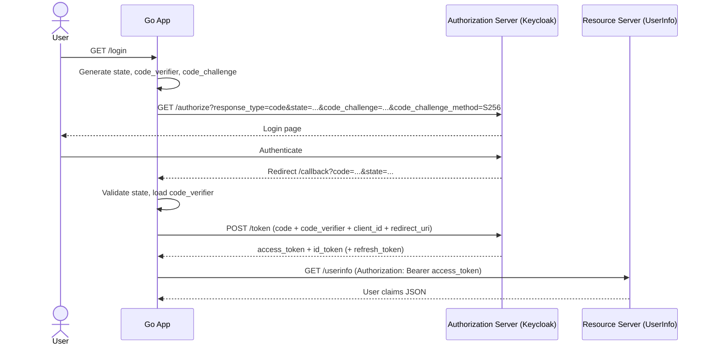

# Authorization Code Flow with PKCE (Go)

Minimal Go module that demonstrates OAuth 2.0 Authorization Code Flow with PKCE (Proof Key for Code Exchange) against a local Keycloak server.

This project is intentionally educational: it implements the protocol manually (no high-level OAuth libraries) so each redirect, request, and token step is explicit and easy to inspect.

## What is PKCE?

PKCE protects public clients from authorization code interception attacks.

In basic Authorization Code Flow, an attacker who steals the authorization code may redeem it. PKCE adds a per-login secret:

- `code_verifier`: high-entropy secret generated by the client and kept local.
- `code_challenge`: `BASE64URL(SHA256(code_verifier))` sent in the `/authorize` request.

Later, during `/token`, the client sends `code_verifier`, and Keycloak verifies it matches the earlier `code_challenge`.

## Flow (Step-by-Step)

1. Client generates `state`, `code_verifier`, and `code_challenge`.
2. Client redirects browser to Keycloak `/auth` with `code_challenge` + `state`.
3. User authenticates in Keycloak.
4. Keycloak redirects to `/callback` with authorization `code` and `state`.
5. Client validates `state` and sends `code` + `code_verifier` to `/token`.
6. Keycloak recomputes challenge from verifier and validates PKCE.
7. Keycloak returns tokens (`access_token`, `id_token`, optionally `refresh_token`).
8. Client calls `/userinfo` using the access token.

## Sequence Diagram



## Project Structure

- `main.go` — HTTP server setup and route registration.
- `handlers.go` — `/login`, `/callback`, `/profile` handlers and protocol calls.
- `pkce.go` — `code_verifier` and `code_challenge` generation.
- `utils.go` — state/verifier storage, JWT decode helper, response/log utilities.

## Code Walkthrough

### 1. `code_verifier` generation (PKCE secret)

```go
func generateCodeVerifier() (string, error) {
	random := make([]byte, 64) // 64 bytes -> 86 chars in base64url
	if _, err := rand.Read(random); err != nil {
		return "", fmt.Errorf("generate code verifier: %w", err)
	}
	return base64.RawURLEncoding.EncodeToString(random), nil
}
```

This creates a cryptographically random verifier in the allowed PKCE length range (43–128 chars).

### 2. `code_challenge` generation

```go
func generateCodeChallenge(verifier string) string {
	sum := sha256.Sum256([]byte(verifier))
	return base64.RawURLEncoding.EncodeToString(sum[:])
}
```

This computes the S256 challenge sent to Keycloak in the authorization request.

### 3. `/login` handler

```go
state, _ := generateState()
verifier, _ := generateCodeVerifier()
challenge := generateCodeChallenge(verifier)
storeStateVerifier(state, verifier)
authURL, _ := buildAuthorizationURL(state, challenge)
http.Redirect(w, r, authURL, http.StatusFound)
```

`/login` prepares anti-CSRF `state` and PKCE values, stores state+verifier in memory, then redirects to Keycloak with `code_challenge`.

### 4. `/callback` handler (PKCE validation path)

```go
code := query.Get("code")
state := query.Get("state")
verifier, ok := consumeCodeVerifier(state)
if !ok {
	// state invalid / replayed
}
```

`/callback` validates state and consumes the stored verifier so each flow is one-time use.

### 5. Token exchange (`/token` with `code_verifier`)

```go
form := url.Values{}
form.Set("grant_type", "authorization_code")
form.Set("code", code)
form.Set("redirect_uri", redirectURI)
form.Set("client_id", clientID)
form.Set("code_verifier", verifier)

tokenReq, _ := http.NewRequest(http.MethodPost, tokenEndpoint, bytes.NewBufferString(form.Encode()))
tokenReq.Header.Set("Content-Type", "application/x-www-form-urlencoded")
tokenResp, _ := http.DefaultClient.Do(tokenReq)
```

This is the critical PKCE proof step: Keycloak checks `code_verifier` against the previously stored challenge before issuing tokens.

## Running the Example

1. Start Keycloak and create the realm/client/user as described in the root repository README.
2. Create your local env file:

```bash
cd auth-code-flow-with-pkce-go
cp .env.example .env
```

3. Run the module:

```bash
go run main.go
```

4. Open:

```text
http://localhost:3000/login
```

### Environment Variables

The app loads configuration from `.env` using `godotenv`:

- `SERVER_ADDR`
- `KEYCLOAK_BASE_URL`
- `REALM`
- `CLIENT_ID`
- `REDIRECT_URI`

## What to Observe

- The logged authorization URL includes `state`, `code_challenge`, and `code_challenge_method=S256`.
- The callback includes `code` and `state`.
- The token request payload includes `code_verifier`.
- Raw token JSON and decoded JWT header/claims are printed.
- UserInfo response is printed after access token usage.

## Learning Notes

- PKCE replaces the need to rely on a `client_secret` for public clients (e.g., browser/native apps) that cannot keep secrets safely.
- PKCE is required by modern guidance for public clients and strongly recommended broadly.
- If `code_verifier` is missing or incorrect, Keycloak rejects the token request (`invalid_grant`), and no tokens are issued.
