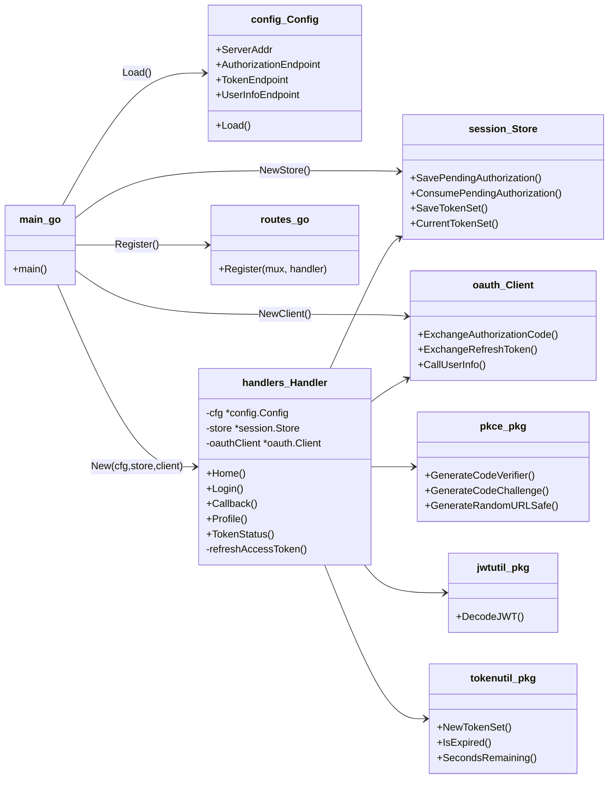
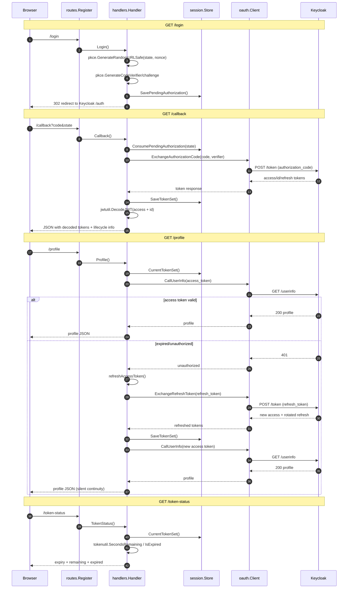
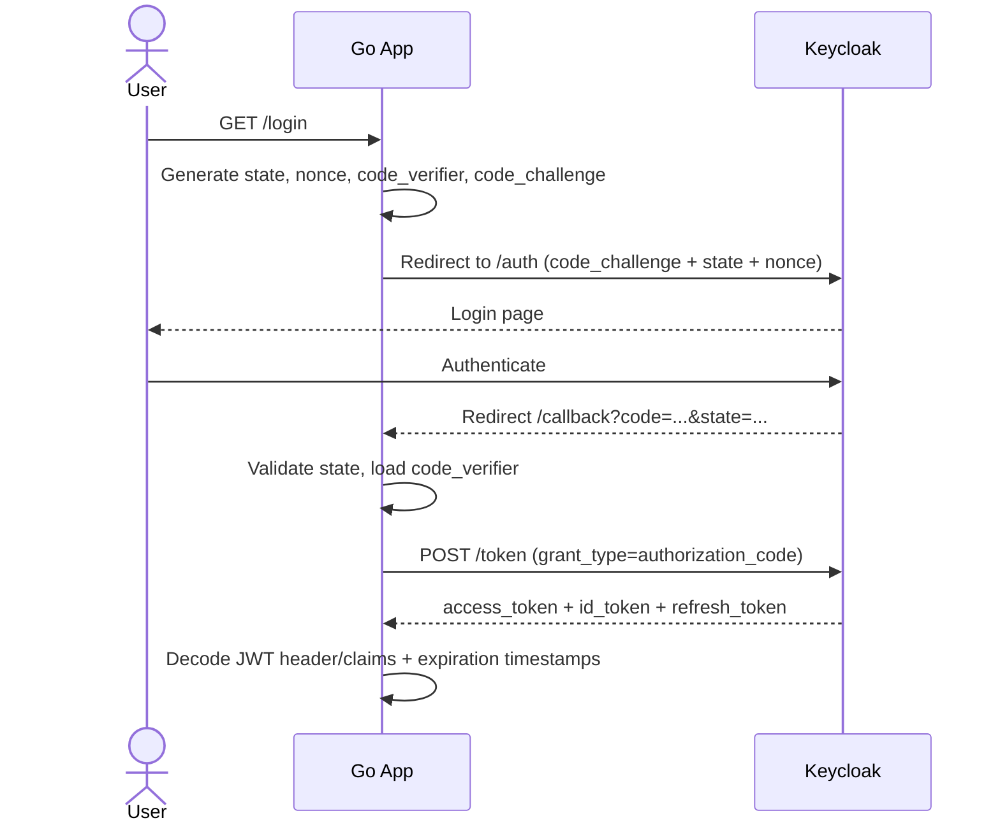
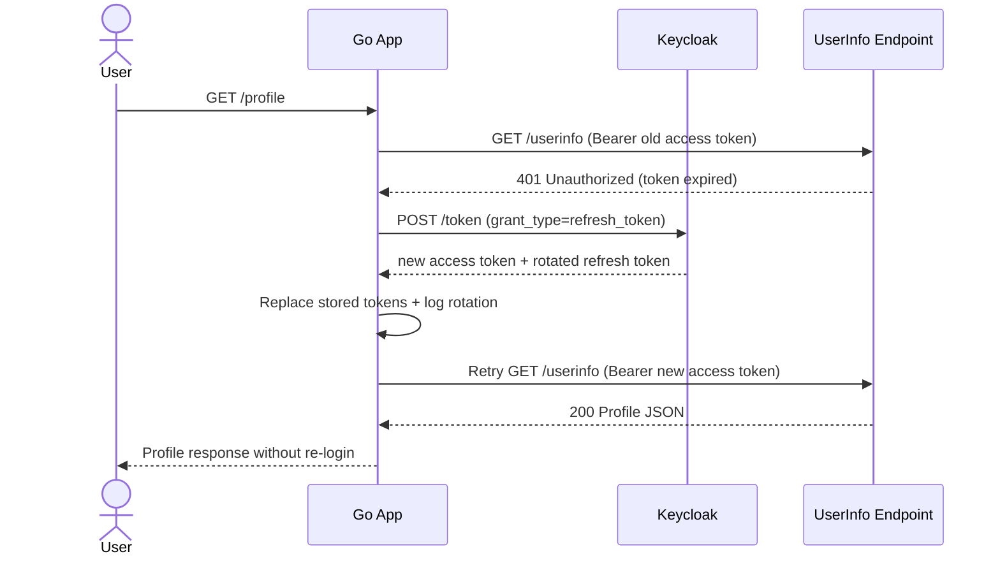
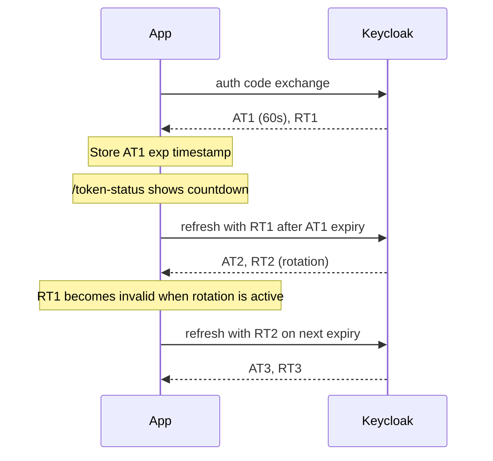

# OAuth 2.0 + OIDC Refresh Token Flow (Go + Keycloak)

Learning-focused Go module that demonstrates:

- Authorization Code Flow with PKCE
- Access token expiration behavior
- Refresh token usage for silent continuity
- Refresh token rotation detection
- Token lifecycle visibility with verbose logs

This module intentionally avoids high-level OAuth abstraction libraries so protocol details stay visible.

## What this example teaches

1. **Access tokens are short-lived by design**
   - Short lifespan limits blast radius if an access token is leaked.
   - In this lab, Keycloak access tokens are configured to expire quickly (60 seconds).

2. **Refresh tokens keep the user session alive**
   - Instead of forcing re-login, the app exchanges a refresh token for a new access token.
   - This enables **silent session continuity**.

3. **Refresh tokens are sensitive credentials**
   - Whoever holds a valid refresh token can mint new access tokens.
   - Keep refresh tokens server-side and never expose them unnecessarily.

4. **Rotation improves security**
   - With Keycloak `Revoke Refresh Token = ON`, refresh tokens are rotated.
   - Old refresh tokens become invalid after use, reducing replay risk.

5. **PKCE is still essential**
   - PKCE protects the authorization code exchange for public clients with no client secret.
   - It remains critical even when refresh tokens are used later in the session lifecycle.

## Project structure

```text
refresh-token-flow/
  main.go
  .env.example
  internal/
    config/
      config.go
    routes/
      routes.go
    handlers/
      handlers.go
      refresh.go
    pkce/
      pkce.go
    oauth/
      client.go
    tokenutil/
      tokenutil.go
    jwtutil/
      jwtutil.go
    session/
      store.go
    models/
      types.go
```

## Internal architecture (wiring and request execution)

This section explains how `main.go` wires dependencies and how each request travels through routes, handlers, storage, and Keycloak calls.

### Class / file interaction diagram



### Per-request execution diagram



### Wiring summary

`main.go` creates shared singletons (`cfg`, `store`, `oauthClient`) once, injects them into one `handlers.Handler`, and route handlers use that same instance across requests. That is why in-memory token and pending-auth state are preserved through the flow.

## Keycloak configuration (required)

- Base URL: `http://127.0.0.1:8080`
- Realm: `oauth-poc`
- Client ID: `oauth-refresh-client`
- Client type: **Public** (no client secret)
- PKCE: **Enabled** (`S256`)
- Valid redirect URI: `http://localhost:3000/callback`
- Access Token Lifespan: **60 seconds**
- Revoke Refresh Token: **ON**

OIDC endpoints used by the app (derived from base + realm):

- Authorization: `/realms/oauth-poc/protocol/openid-connect/auth`
- Token: `/realms/oauth-poc/protocol/openid-connect/token`
- UserInfo: `/realms/oauth-poc/protocol/openid-connect/userinfo`
- JWKS: `/realms/oauth-poc/protocol/openid-connect/certs`

## Setup

1. Start Keycloak locally:

```bash
docker run -p 127.0.0.1:8080:8080 \
  -e KC_BOOTSTRAP_ADMIN_USERNAME=admin \
  -e KC_BOOTSTRAP_ADMIN_PASSWORD=admin \
  quay.io/keycloak/keycloak:26.6.1 start-dev
```

2. Configure realm/client/user in Keycloak as listed above.

3. Configure local app:

```bash
cd refresh-token-flow
cp .env.example .env
```

4. Run:

```bash
go mod tidy
go run .
```

5. Start flow:

```text
http://localhost:3000/login
```

## Endpoints in this module

- `GET /login`
  - Generates `state`, `nonce`, `code_verifier`, `code_challenge`
  - Logs full authorization URL
  - Redirects to Keycloak

- `GET /callback`
  - Validates `state`
  - Exchanges authorization code for tokens
  - Stores token set in memory
  - Prints:
    - raw token response
    - decoded access token (header + claims + exp)
    - decoded ID token (header + claims + exp)
    - refresh token info

- `GET /profile`
  - Calls UserInfo with current access token
  - If access token is rejected (expired), triggers refresh flow automatically
  - Retries UserInfo with the new access token

- `GET /token-status`
  - Returns token expiration timestamp
  - Returns seconds remaining
  - Returns expired/non-expired status

## Flow diagram: login + code exchange (PKCE)



## Flow diagram: refresh flow + silent continuity



## Token lifecycle timeline



## Refresh token lifecycle explained

1. Initial login returns:
   - `access_token` (short-lived)
   - `refresh_token` (used for new access tokens)
2. Access token expires quickly.
3. App calls token endpoint with `grant_type=refresh_token`.
4. Keycloak issues a new access token and (with rotation enabled) a new refresh token.
5. App replaces old tokens in memory.

If the app accidentally reuses an old rotated refresh token, Keycloak rejects it, demonstrating replay protection in practice.

## Sample HTTP interactions

### 1) Check token status before login

```bash
curl -s http://localhost:3000/token-status
```

Example response:

```json
{
  "has_tokens": false,
  "message": "no tokens in memory yet. Complete /login then /callback first."
}
```

### 2) Trigger login

```bash
curl -i http://localhost:3000/login
```

You will receive a `302` redirect to Keycloak `/auth?...`.

### 3) Callback response (after browser login)

`/callback` returns decoded token details and stores token lifecycle state in memory.

Example response shape:

```json
{
  "message": "Authorization Code + PKCE completed. Tokens stored in memory for lifecycle demo.",
  "nonce_check": "nonce validated",
  "access_token_expires_at": "2026-05-07T12:00:00Z",
  "decoded_access_token": {
    "header": {"alg": "RS256", "typ": "JWT"},
    "claims": {"sub": "...", "exp": 1746619200},
    "exp_unix": 1746619200,
    "expires_at": "2026-05-07T12:00:00Z"
  }
}
```

### 4) Call profile (auto-refresh if expired)

```bash
curl -s http://localhost:3000/profile
```

If the access token is expired, response indicates refresh behavior:

```json
{
  "message": "userinfo succeeded after refresh (silent session continuity)",
  "refresh": {
    "triggered": true,
    "rotation_occurred": true,
    "new_access_expires_at": "2026-05-07T12:02:00Z"
  }
}
```

## Troubleshooting

- `state validation failed`:
  - Ensure the callback belongs to the same in-memory app instance and flow.
- `nonce validation failed`:
  - Ensure `nonce` is included in authorization request and ID token is from the same request.
- refresh failures:
  - Confirm client is public, refresh tokens enabled, and old rotated token is not reused.

## Security scope for this PoC

This module is intentionally local and educational:

- In-memory token storage only
- JWT decode visibility (not full cryptographic signature verification)
- Verbose protocol logs

Do not deploy this exact shape as-is to production without hardening.
